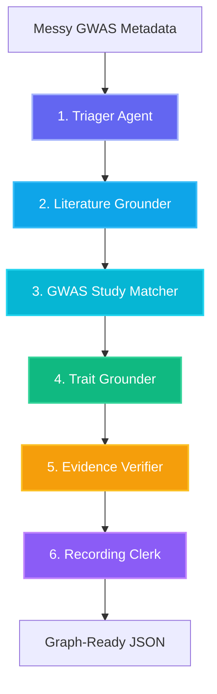

# TraitGraph Managed Agents Architecture

TraitGraph is a **Managed Agents-compatible GWAS Study Matcher and Evidence Verifier**. It coordinates specialized, purpose-built agentic logic layers to ingest messy, pre-publication GWAS metadata, ground it in ontology standards, verify matches against curated catalogs, and output rich, provenance-backed Knowledge Graph elements.



---

## Agent Definitions & Curation Pipeline

### 1. Triager Agent
* **Role**: Ingestion & Feature Extraction
* **Description**: Extracts critical clues from messy, pre-publication GWAS submission metadata, including study titles, author lists, reported trait descriptions, sample cohorts, preprint/submission IDs, and target filenames of summary statistics files.
* **Inputs**: Unstructured/Messy Pre-publication Metadata JSON.
* **Outputs**: Structured Triaged Metadata Object.

### 2. Literature Grounder / Publication Verifier
* **Role**: Literature Reference Verification & Science Skill Linker
* **Description**: Matches and validates study bibliographic metadata against available literature resources.
  * *Demo Routing*: Currently defaults to a high-fidelity local catalog mock containing curated GWAS publication records (e.g., matching known preprints to finalized publications).
  * *Skill Integration Placeholder*: Placed to route dynamically to literature/OpenAlex Science Skills (`literature-search-openalex`, `literature-search-europepmc`, or `pubmed-database`) to locate matching literature references.
* **Code Integration / Placement**:
  ```python
  # ROUTING PLACEHOLDER: Connect to OpenAlex/PubMed Literature Science Skill
  # def query_literature_skill(title, authors):
  #     # Invoke the literature-search-openalex skill to resolve real-world DOIs/PMIDs
  #     # response = call_skill("literature-search-openalex", query={"title": title, "authors": authors})
  #     # return response.results
  #     pass
  ```

### 3. GWAS Study Matcher
* **Role**: Deterministic Study Reconciliation Engine
* **Description**: Runs deterministic Jaccard token-matching logic on study titles, calculates author list overlap, and computes summary statistics filename matching similarity. 
* **Inputs**: Triaged prepub metadata & catalog publication records.
* **Outputs**: Study match records including Jaccard similarity scores, overlap percentages, and a match confidence score.

### 4. Trait Grounder
* **Role**: Biological Ontology Curation & Semantic Mapping
* **Description**: Normalizes unstructured trait text into formal ontology concepts (e.g., EFO, MONDO, HPO).
  * *First Pass*: Executes highly performant local, deterministic lookup database mapping exact match keys or synonyms.
  * *Second Pass (Live Gemini API Routing)*: If the trait text is compound, nested, or highly ambiguous (e.g., `"wheeze/asthma/allergy"`), routes the text to the live Gemini API (`gemini-2.5-flash`) for multi-concept decomposition and suggested mapping recommendations.
* **Inputs**: Raw reported trait text.
* **Outputs**: Normalized ontology IDs, labels, and mapping type status.

### 5. Evidence Verifier
* **Role**: Curation Audit & Gatekeeper
* **Description**: Synthesizes output metrics from the GWAS Study Matcher and the Trait Grounder. It assesses matching confidence scores, checks trait ontology grounding certainty, evaluates metadata completeness, and inspects curator review flags to determine ingestion readiness.
* **Action Routing**:
  * `auto_merge`: High confidence match (score >= 70%) with exact ontology grounding.
  * `curator_review`: Sub-threshold match confidence, approximate ontology mappings, or compound traits needing curation.
  * `do_not_merge`: Mismatched studies, mismatched files, or complete lack of confidence evidence.

### 6. Recording Clerk
* **Role**: Knowledge Graph Serializer & Provenance Recorder
* **Description**: Packages all matched features, similarity scores, ontology identifiers, curator decisions, and optional AI curator analysis layers into a schema-compliant graph-ready JSON payload, stamped with full runner and execution runtime provenance.

---

## Safety & Ingestion Constraints

1. **Information Integrity**: Do **NOT** invent, synthesize, or hallucinate PubMed PMIDs, GCST accession numbers, EFO/MONDO ontology IDs, or publication metadata.
2. **Source of Truth**: The local, deterministic TraitGraph scores and EFO/MONDO keys remain the absolute, immutable source of truth for the match status.
3. **AI Curation Separation**: Any insight layer or concept recommendation produced by the Gemini API must be clearly labeled as **"AI-Suggested (Not Verified)"** in the final knowledge graphs and UI cards.
4. **Demo Scope Restriction**: Do not implement ClinVar, UniProt, or AlphaFold in the main curation demo. Keep them strictly in future extensions to avoid destabilizing the codebase.
