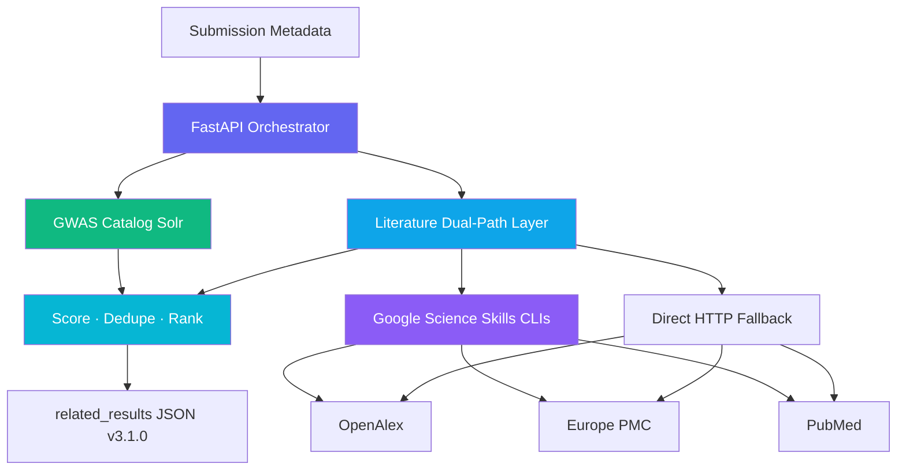

# GWAS PrePubMatch Unified Discovery Architecture

GWAS PrePubMatch makes pre-publication GWAS summary statistics discoverable alongside published GWAS Catalog studies and their literature.

---

## Server modules

| Module | Role |
|--------|------|
| `config.py` | Environment-based settings |
| `http_client.py` | Retries, timeouts, TTL cache |
| `gwas_catalog.py` | GWAS Catalog Solr + scoring |
| `skill_runner.py` | Google Science Skills CLIs (primary literature path) |
| `literature.py` | Direct HTTP fallback for OpenAlex, Europe PMC, PubMed |
| `literature_search.py` | Dual-path orchestrator (skills first, HTTP per source on failure) |
| `discover.py` | Parallel Catalog + literature orchestration + merge |
| `main.py` | FastAPI routes + health probes |

---

## Literature dual-path (v0.4.0)

For each literature source (OpenAlex, Europe PMC, PubMed):

1. If Science Skills are installed → invoke `skill_runner.py` CLI via `uv run`
2. If a skill call errors or skills are missing → fall back to `literature.py` direct HTTP for that source only

Provenance in discover responses:

- `literature_provenance.backend`: `science_skills`, `science_skills_with_http_fallback`, or `direct_http`
- `skill_provenance.skills_used`: official skill names (`literature-search-openalex`, etc.)

Install skills: `bash scripts/setup_science_skills.sh` (vendors from [google-deepmind/science-skills](https://github.com/google-deepmind/science-skills)).

---

## Production features

- **Partial failure** — returns Catalog results even if PubMed/OpenAlex fail; surfaces `degraded_sources`
- **Health probes** — `/api/health` checks each upstream with latency
- **TTL cache** — configurable in-memory cache for Solr and literature
- **Docker** — `Dockerfile` vendors Science Skills at build time
- **Schema versioning** — `schema_version: 3.1.0` in all discover responses

---

## API

- `GET /api/health`
- `POST /api/discover`

Run locally: `bash scripts/run_server.sh`

Run Docker: `docker compose up --build`

---

## Safety Constraints

1. Do **NOT** invent PMIDs, DOIs, GCST accessions, or ontology IDs.
2. Deterministic match scores remain the source of truth.
3. All external IDs must come from live API responses.
