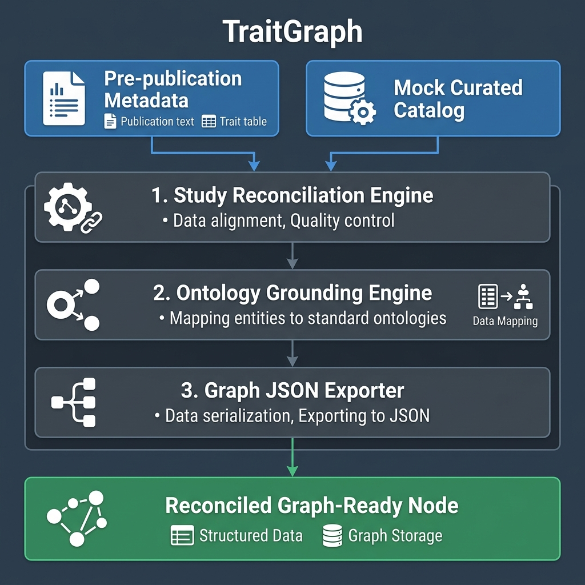
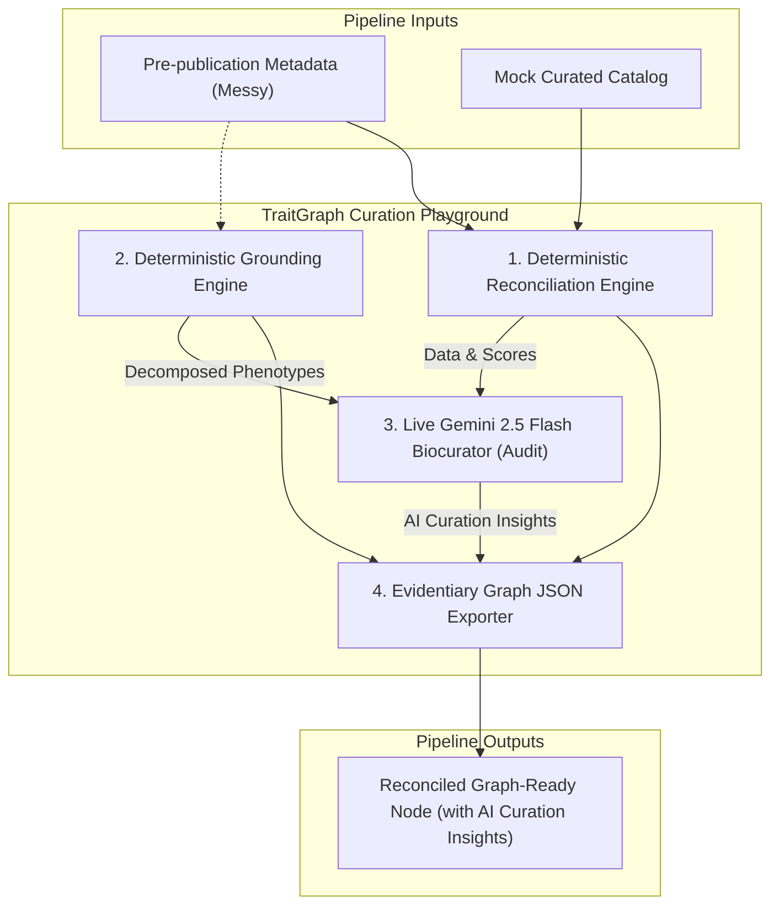
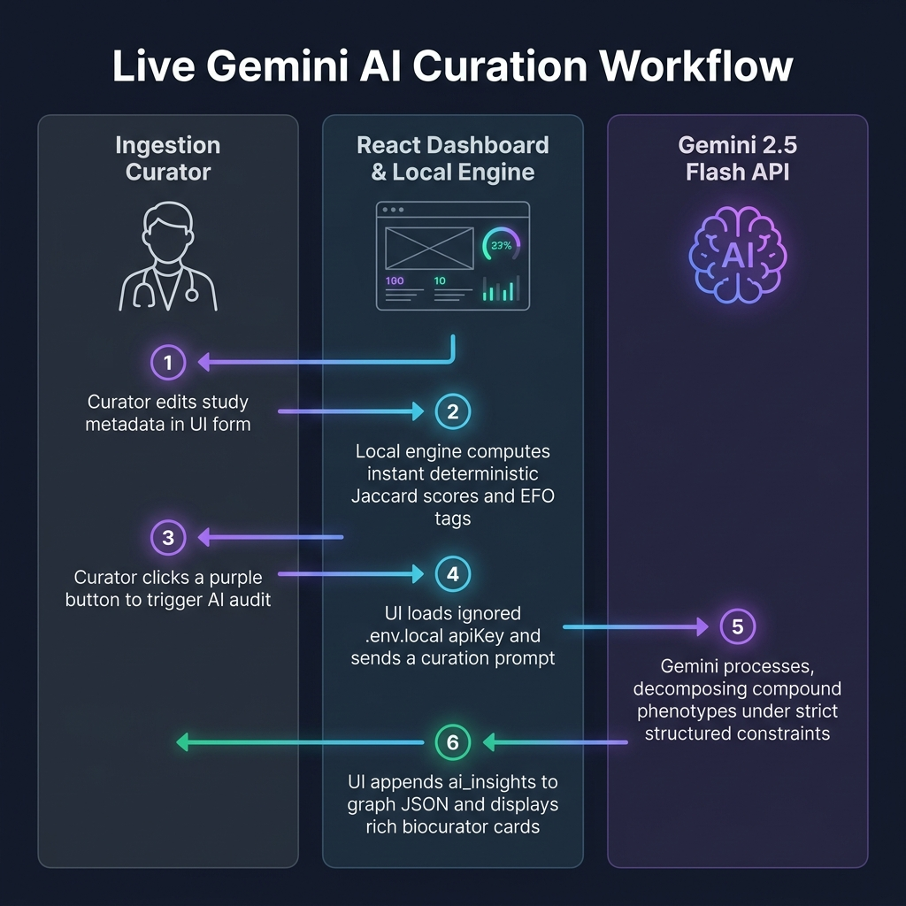
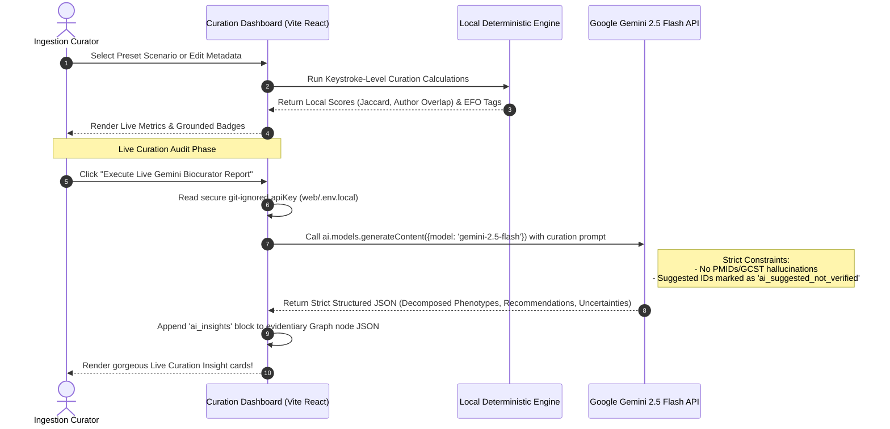

# TraitGraph

**TraitGraph** is a high-performance metadata curation and ingestion pipeline designed to reconcile messy, pre-publication GWAS (Genome-Wide Association Studies) summary-statistics metadata with published, curated records. It normalizes reported trait definitions to standardized medical ontologies (e.g. EFO, MONDO), constructs rich provenance trails, and outputs graph-ready JSON representations optimized for Knowledge Graph (KG) integration.

This repository implements the **first local, deterministic MVP** designed specifically for presentation-grade reliability during hackathons. It operates entirely locally without external network API requirements.

---

## Architecture Overview

The system consists of three modular pipelines:



<details>
<summary>🔍 Click to view editable Mermaid Diagram Source</summary>



</details>

1. **Reconciliation Engine (`src/traitgraph/reconcile.py`)**:
   - Calculates **Jaccard Title Similarity** by tokenizing study titles (removing common stopwords).
   - Computes **Author Overlap** by normalizing spelling, spaces, and punctuation (e.g. "Smith J." vs "Smith J") and checking overlapping coverage.
   - Checks **Data File Overlap** to flag identical datasets.
   - Outputs a weighted overall confidence score (40% Title, 30% Authors, 30% Filename similarity).

2. **Local Ontology Grounding (`src/traitgraph/ontology_grounding.py`)**:
   - Evaluates strings for compound concepts (such as slashes `/`, commas `,`, and `"and"` conjunctions).
   - Deterministically maps traits against a local lookup table to assign standard Experimental Factor Ontology (EFO) / MONDO identifiers.
   - Automatically raises review indicators for synonyms, approximate matches, or completely unknown strings.

3. **Graph JSON Exporter (`src/traitgraph/export.py`)**:
   - Preserves all raw user inputs exactly.
   - Compiles reconciliation confidence reports, matched catalog schemas, normalized ontology terms, and granular manual review flags.
   - Embeds exhaustive runtime metadata headers (ISO timestamps, tool versions, run UUIDs).

---

## Live Gemini AI Biocurator Flow 🧠

To complement our deterministic matching, the dashboard supports executing an **AI-powered curation audit** using the live **Gemini 2.5 Flash** API via the official `@google/genai` client:





---

## Quick Start

### Prerequisites
- Python 3.6+
- Zero external package dependencies (uses built-in standard library).

### Environment Setup (Recommended)

To ensure consistent execution using **Python 3** and avoid any legacy system Python conflicts, you can set up a local virtual environment using **`uv`** with a custom terminal prompt display name:

```bash
# 1. Initialize the virtual environment with custom display prompt
uv venv --prompt traitgraph

# 2. Activate the virtual environment (macOS/Linux)
source .venv/bin/activate
# On Windows:
# .venv\Scripts\activate
```

Once activated, your terminal prompt will display **`(traitgraph)`** to indicate the active environment, and your terminal's `python` alias will automatically point to your modern virtual environment's Python 3 engine.

### 1. Run the Reconciliation Pipeline

Execute the MVP driver wrapper script to run all four test and demo scenarios against the mock catalog:

* **Using the activated `uv` virtual environment (or standard python3):**
  ```bash
  python3 .agent/skills/traitgraph-gwas-reconciler/scripts/reconcile_gwas.py
  ```

* **Or directly running with `uv run`:**
  ```bash
  uv run python3 .agent/skills/traitgraph-gwas-reconciler/scripts/reconcile_gwas.py
  ```

### 2. Expected Console Output

On success, a gorgeous multi-scenario CLI dashboard will render, culminating in a comparison table and granular scenario drilldowns:

```
================================================================================
        TRAITGRAPH GWAS RECONCILER - HACKATHON MVP DEMO DRIVER
================================================================================
[+] Loading mock curated GWAS Catalog records: traitgraph_mock_catalog_records.json

--------------------------------------------------------------------------------
▶ RUNNING ORIGINAL MVP DEMO
  Description : Childhood wheeze/asthma with probable study match and approximate grounding
  Input Title : 'Shared and distinct genetic risk factors for childhood-onset and adult-onset asthma'
  Input Trait : 'childhood wheeze/asthma'
  Input Auth  : ['Pividori M', 'Schoettler N', 'Nicolae DL']
--------------------------------------------------------------------------------
[+] Output written to: outputs/traitgraph_reconciled_asthma_graph.json

--------------------------------------------------------------------------------
▶ RUNNING SCENARIO 1: HIGH-CONFIDENCE MATCH
  Description : Childhood asthma with identical title/authors/stats-file (100% study match)
  Input Title : 'Shared and Distinct Genetic Risk Factors for Childhood Onset and Adult Onset Asthma: Genome- and Transcriptome-wide Studies'
  Input Trait : 'childhood asthma'
  Input Auth  : ['Pividori M.', 'Schoettler N.', 'Nicolae D. L.']
--------------------------------------------------------------------------------
[+] Output written to: outputs/traitgraph_scenario_1_high_confidence.json

--------------------------------------------------------------------------------
▶ RUNNING SCENARIO 2: AMBIGUOUS TRAIT MATCH
  Description : wheeze/asthma/allergy mapping to multiple ontology concepts (triggers manual review)
  Input Title : 'Shared and distinct genetic risk factors for childhood-onset and adult-onset asthma'
  Input Trait : 'wheeze/asthma/allergy'
  Input Auth  : ['Pividori M', 'Schoettler N', 'Nicolae DL']
--------------------------------------------------------------------------------
[+] Output written to: outputs/traitgraph_scenario_2_ambiguous_trait.json

--------------------------------------------------------------------------------
▶ RUNNING SCENARIO 3: NO CONFIDENT CATALOG MATCH
  Description : Similar title but completely different cohort/authors (shows system does not over-match)
  Input Title : 'Genetic risk factors for childhood-onset and adult-onset asthma in a cohort of Latin American individuals'
  Input Trait : 'asthma'
  Input Auth  : ['Gomez A', 'Martinez B', 'Silva C']
--------------------------------------------------------------------------------
[+] Output written to: outputs/traitgraph_scenario_3_no_match.json

================================================================================
                    FINAL MULTI-SCENARIO METRIC COMPARISON
================================================================================
╔══════════════════════════════════╤════════════════════════╤════════════════╤══════════╤════════╗
║ Scenario                         │ Reported Trait         │ Matched Study  │ Confidence │ Review? ║
╠══════════════════════════════════╪════════════════════════╪════════════════╪══════════╪════════╣
║ ORIGINAL MVP DEMO                │ childhood wheeze/asthm │ GCST90001234 ( │ 57.69%   │ YES ⚠️ ║
║ SCENARIO 1: HIGH-CONFIDENCE MATC │ childhood asthma       │ GCST90001234 ( │ 100.00%  │ YES ⚠️ ║
║ SCENARIO 2: AMBIGUOUS TRAIT MATC │ wheeze/asthma/allergy  │ GCST90001234 ( │ 57.69%   │ YES ⚠️ ║
║ SCENARIO 3: NO CONFIDENT CATALOG │ asthma                 │ NONE           │ 0.00%    │ YES ⚠️ ║
╚══════════════════════════════════╧════════════════════════╧════════════════╧══════════╧════════╝

================================================================================
                       SCENARIO DRILLDOWN ANALYSIS
================================================================================

★ ORIGINAL MVP DEMO
  • Reported Phenotype : 'childhood wheeze/asthma'
  • Matched Accession  : GCST90001234 (PMID:31036433) (Confidence: 57.69%)
  • Grounded Ontology  : MONDO:0005405 (APPROXIMATE)
  • Manual Review Req. : YES ⚠️
  • Trigger Reasons    :
    - Study match is probable rather than exact (Confidence: 57.69%).
    - Study match confidence score is low (< 70%).
    - Reported trait contains slash '/' character indicating alternative or joint phenotypes.
    - Grounding is approximate for combined wheeze/asthma phenotype.

★ SCENARIO 1: HIGH-CONFIDENCE MATCH
  • Reported Phenotype : 'childhood asthma'
  • Matched Accession  : GCST90001234 (PMID:31036433) (Confidence: 100.00%)
  • Grounded Ontology  : MONDO:0005405 (SYNONYM)
  • Manual Review Req. : YES ⚠️
  • Trigger Reasons    :
    - Grounding is synonym-based (childhood asthma normalized to childhood onset asthma).

★ SCENARIO 2: AMBIGUOUS TRAIT MATCH
  • Reported Phenotype : 'wheeze/asthma/allergy'
  • Matched Accession  : GCST90001234 (PMID:31036433) (Confidence: 57.69%)
  • Grounded Ontology  : MONDO:0004979 | MONDO:0005405 | EFO:0003900 (AMBIGUOUS)
  • Manual Review Req. : YES ⚠️
  • Trigger Reasons    :
    - Study match is probable rather than exact (Confidence: 57.69%).
    - Study match confidence score is low (< 70%).
    - Reported trait contains slash '/' character indicating alternative or joint phenotypes.
    - Trait maps to multiple distinct concepts: 'wheeze' (approx. MONDO:0005405), 'asthma' (MONDO:0004979), and 'allergy' (EFO:0003900).
    - Ambiguous combined phenotype requires curator decomposition into independent graph edges.

★ SCENARIO 3: NO CONFIDENT CATALOG MATCH
  • Reported Phenotype : 'asthma'
  • Matched Accession  : NONE (Confidence: 0.00%)
  • Grounded Ontology  : MONDO:0004979 (EXACT)
  • Manual Review Req. : YES ⚠️
  • Trigger Reasons    :
    - No matching record found in mock catalog.

================================================================================
               MVP DEMO CONCLUDED SUCCESSFULLY WITH ALL SCENARIOS
================================================================================
```

### 3. Review the Exported Output Graph Files

The resulting Knowledge Graph payloads are saved under the `outputs/` directory:
- `outputs/traitgraph_reconciled_asthma_graph.json` (Original MVP Demo payload)
- `outputs/traitgraph_scenario_1_high_confidence.json` (Scenario 1 payload)
- `outputs/traitgraph_scenario_2_ambiguous_trait.json` (Scenario 2 payload)
- `outputs/traitgraph_scenario_3_no_match.json` (Scenario 3 payload)

Each output file contains exact submitted metadata, catalog matching results, Jaccard similarities, normalized ontologies, complete provenance run ID/timestamp headers, and structured review flags for curation.

---

## Interactive Web Dashboard

To make curating and auditing these study matches extremely visual and interactive, we've built a high-fidelity React-based curation dashboard under the `web/` folder. It runs entirely locally and imports the pre-generated output graph payloads dynamically!

### 1. Launch the Dashboard
Navigate into the dashboard folder, install local dependencies, and launch the Vite development engine:

```bash
# 1. Move to the web folder
cd web

# 2. Install dependencies (fully local and fast)
npm install

# 3. Spin up the Vite development server
npm run dev
```

### 2. View in the Browser
Open your browser and navigate to:
👉 **[http://localhost:5173/](http://localhost:5173/)**

### 3. Key Dashboard Features
* **Interactive Scenario Selector Tabs**: Toggle in real-time between the four classes of GWAS study matches (Original MVP, Scenario 1: High Confidence, Scenario 2: Ambiguous Trait, Scenario 3: No Catalog Match).
* **Side-by-Side Metadata Auditing Cards**: Compares raw submitted pre-publication study titles, authors, and stats files against curated, validated catalog records.
* **Matching & Grounding Gauges**: Visualizes study match confidence scores with color-coded confidence ranges, standard ontology tags (`MONDO:0005405`), and multi-concept indicators.
* **Curator Review Banner Alerts**: Glowing yellow and red alerts that dynamically surface exact curation action reasons based on the generated review flags.
* **Graph Node Evidentiary Record Preview**: Collapsible, high-contrast JSON code block displaying the graph-ready ingest payload with an integrated one-click "Copy JSON" utility.