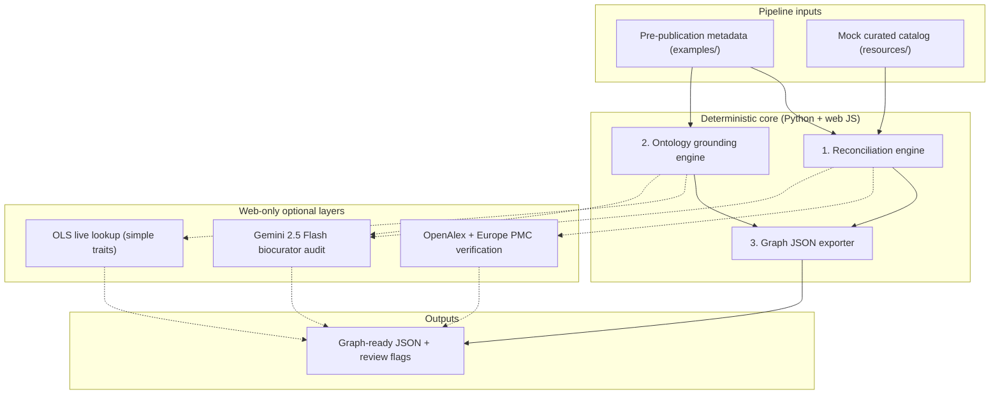
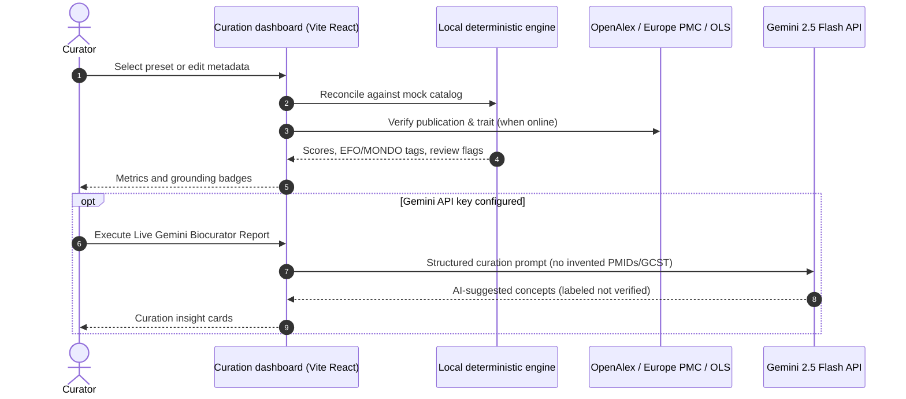

# TraitGraph

**TraitGraph** is a metadata curation and ingestion pipeline that reconciles messy, pre-publication GWAS (Genome-Wide Association Studies) summary-statistics metadata with published, curated records. It normalizes reported trait definitions to standardized medical ontologies (e.g. EFO, MONDO), constructs provenance trails, and outputs graph-ready JSON for Knowledge Graph (KG) integration.

This repository ships two complementary surfaces:

| Surface | Network | Role |
|---------|---------|------|
| **Python CLI** (`.agent/skills/.../reconcile_gwas.py`) | Fully offline | Deterministic reconciliation, local ontology lookup, batch demo scenarios → `outputs/` |
| **Web curation playground** (`web/`) | Optional live APIs | Interactive UI with in-browser matching, OpenAlex / Europe PMC / OLS verification, and optional Gemini biocuration |

The Python engine is the **source of truth** for deterministic scores and ontology IDs. Live API and Gemini layers in the web UI provide supplementary evidence and AI-suggested insights, always labeled as unverified when not grounded locally.

For the six-stage Managed Agents orchestration model (Triager → Recording Clerk), see [AGENTS.md](AGENTS.md).

---

## Repository layout

```
agihouse-hackathon-30may2026/
├── src/traitgraph/              # Core Python modules (reconcile, grounding, export)
├── examples/                    # Messy pre-publication metadata inputs (4 scenarios)
├── resources/
│   └── traitgraph_mock_catalog_records.json   # Mock curated GWAS catalog
├── outputs/                     # Graph-ready JSON from the CLI driver (regenerated on run)
├── web/                         # Vite + React curation dashboard
├── .agent/skills/traitgraph-gwas-reconciler/
│   ├── SKILL.md                 # Agent skill profile
│   ├── skill.yaml               # Skill manifest
│   └── scripts/reconcile_gwas.py  # CLI demo driver
└── AGENTS.md                    # Managed Agents architecture & safety rules
```

---

## Architecture overview

The deterministic core is implemented as three Python modules, orchestrated by the CLI driver and mirrored in JavaScript inside the web app:



### 1. Reconciliation engine (`src/traitgraph/reconcile.py`)

- **Jaccard title similarity** on tokenized study titles (stopwords removed).
- **Author overlap** with normalized spelling and punctuation.
- **Summary statistics filename** similarity.
- Weighted confidence score: 40% title, 30% authors, 30% filename.

### 2. Local ontology grounding (`src/traitgraph/ontology_grounding.py`)

- Detects compound traits (slashes, commas, `"and"`).
- Maps against a local lookup table to EFO / MONDO IDs.
- Flags synonyms, approximate matches, ambiguous multi-concept strings, and unknown terms for curator review.

### 3. Graph JSON exporter (`src/traitgraph/export.py`)

- Preserves raw submitted metadata.
- Embeds reconciliation results, normalized traits, review flags, and runtime provenance (timestamps, run metadata).

---

## Live Gemini biocurator flow (web)

Optional AI curation runs only from the web dashboard when `VITE_GEMINI_API_KEY` is set. Deterministic scores remain authoritative.



**Safety constraints** (see also [AGENTS.md](AGENTS.md)):

- Do not treat Gemini-suggested ontology IDs or accessions as verified.
- Local deterministic match scores and mock-catalog IDs are the ingestion source of truth.

---

## Hackathon stack alignment

- **Antigravity**: Workspace skill under `.agent/skills/traitgraph-gwas-reconciler/`.
- **Managed Agents API**: [AGENTS.md](AGENTS.md) maps the pipeline to six agents; [SKILL.md](.agent/skills/traitgraph-gwas-reconciler/SKILL.md) and [skill.yaml](.agent/skills/traitgraph-gwas-reconciler/skill.yaml) define the reconciler skill.
- **Gemini API**: `gemini-2.5-flash` via `@google/genai` in `web/src/gemini.js` for optional semantic decomposition.
- **Science Skills**: The web app calls **OpenAlex** and **Europe PMC** REST APIs directly (`web/src/liveApis.js`) as demo routing toward literature skills (`literature-search-openalex`, `literature-search-europepmc`, `pubmed-database`). The Python CLI still uses only the local mock catalog.

### Future extensions (out of demo scope)

- **ClinVar, UniProt, AlphaFold**: Structural / protein evidence (not in this repo).
- **Live GWAS Catalog API**: Replace or augment `traitgraph_mock_catalog_records.json`.
- **Science Skill wrappers**: Route literature calls through managed skill entrypoints instead of inline fetch.

---

## Quick start — Python CLI

### Prerequisites

- **Python 3.10+** (stdlib only; no pip dependencies for the core pipeline)
- Optional: [uv](https://github.com/astral-sh/uv) for virtualenv management

### Environment setup (recommended)

```bash
# Initialize virtualenv with a clear prompt name
uv venv --prompt traitgraph

# Activate (macOS/Linux)
source .venv/bin/activate
```

### Run the demo driver

From the repository root:

```bash
python3 .agent/skills/traitgraph-gwas-reconciler/scripts/reconcile_gwas.py
```

Or without activating the venv:

```bash
uv run python3 .agent/skills/traitgraph-gwas-reconciler/scripts/reconcile_gwas.py
```

The script reads scenario inputs from `examples/`, loads the mock catalog from `resources/`, and writes graph JSON to `outputs/`:

| Scenario | Input (`examples/`) | Output (`outputs/`) |
|----------|----------------------|---------------------|
| Original MVP | `traitgraph_messy_asthma_prepub.json` | `traitgraph_reconciled_asthma_graph.json` |
| High-confidence match | `traitgraph_scenario_1_high_confidence.json` | `traitgraph_scenario_1_high_confidence.json` |
| Ambiguous trait | `traitgraph_scenario_2_ambiguous_trait.json` | `traitgraph_scenario_2_ambiguous_trait.json` |
| No catalog match | `traitgraph_scenario_3_no_match.json` | `traitgraph_scenario_3_no_match.json` |

On success, the terminal prints a multi-scenario comparison table and per-scenario drilldown (confidence, accession, ontology IDs, review reasons).

Each output file includes submitted metadata, catalog match details, normalized ontologies, provenance headers, and structured `review_flags`.

---

## Quick start — Web curation playground

### Prerequisites

- **Node.js 18+** and npm
- Network access for live OpenAlex, Europe PMC, and OLS (browser calls; no API keys required)
- Optional: **Gemini API key** for the biocurator report

### Install and run

```bash
cd web
npm install
npm run dev
```

Open **[http://localhost:5173/](http://localhost:5173/)**.

### Optional: Gemini API key

Create `web/.env.local` (git-ignored) with:

```bash
VITE_GEMINI_API_KEY=your_gemini_api_key_here
```

Restart the dev server after changing env vars. Without a key, deterministic reconciliation and live literature/OLS checks still work; only the Gemini biocurator layer is disabled.

### Dashboard features

- **Preset scenarios**: Four tabs backed by `examples/` JSON (same cases as the CLI).
- **Editable metadata**: Title, trait, authors, stats file, cohort, and notes — reconciled on demand in the browser.
- **Mock catalog matching**: Same Jaccard / author / filename logic as `src/traitgraph/reconcile.py`.
- **Live literature verification**: OpenAlex work search and Europe PMC title search on each reconcile run.
- **Trait grounding**: Local lookup for compound/ambiguous traits; live [OLS4](https://www.ebi.ac.uk/ols4/) search for simple traits when online.
- **Curator review banners**: Surfaces `review_flags` reasons from the deterministic engine.
- **Graph JSON preview**: Collapsible evidentiary payload with copy-to-clipboard.
- **Gemini biocurator report**: Optional structured JSON insights appended as `ai_insights` (AI-suggested, not verified).

Production build:

```bash
cd web && npm run build && npm run preview
```

---

## Regenerating outputs

After changing Python modules or example inputs:

```bash
python3 .agent/skills/traitgraph-gwas-reconciler/scripts/reconcile_gwas.py
```

The web app does not require regenerated `outputs/` files; it imports `examples/` and `resources/` directly at build time.

---

## Related documentation

- [AGENTS.md](AGENTS.md) — Six-agent pipeline, evidence routing (`auto_merge` / `curator_review` / `do_not_merge`), and ingestion safety rules
- [.agent/skills/traitgraph-gwas-reconciler/SKILL.md](.agent/skills/traitgraph-gwas-reconciler/SKILL.md) — Skill usage and workflow for agent tooling
