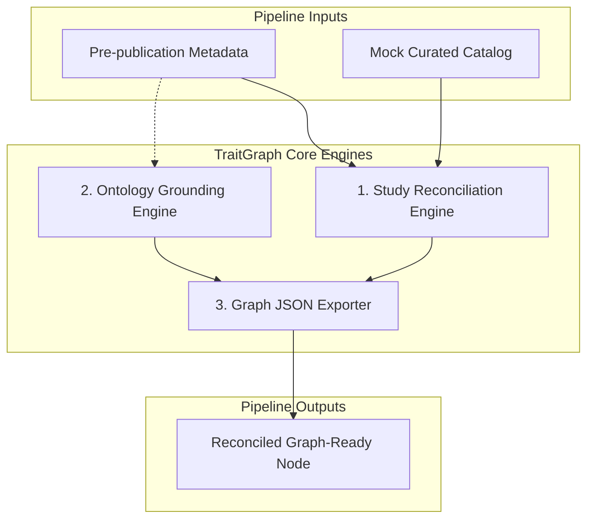

# TraitGraph

**TraitGraph** is a high-performance metadata curation and ingestion pipeline designed to reconcile messy, pre-publication GWAS (Genome-Wide Association Studies) summary-statistics metadata with published, curated records. It normalizes reported trait definitions to standardized medical ontologies (e.g. EFO, MONDO), constructs rich provenance trails, and outputs graph-ready JSON representations optimized for Knowledge Graph (KG) integration.

This repository implements the **first local, deterministic MVP** designed specifically for presentation-grade reliability during hackathons. It operates entirely locally without external network API requirements.

---

## Architecture Overview

The system consists of three modular pipelines:


<details>
<summary>🔍 Click to view editable Mermaid Diagram Source</summary>



</details>

1. **Reconciliation Engine (`src/traitgraph/reconcile.py`)**:
   - Calculates **Jaccard Title Similarity** by tokenizing study titles (removing common stopwords).
   - Computes **Author Overlap** by normalizing spelling, spaces, and punctuation (e.g. "Smith J." vs "Smith J") and checking overlapping coverage.
   - Checks **Data File Overlap** to flag identical datasets.
   - Outputs a weighted overall confidence score (40% Title, 30% Authors, 30% Filename similarity).

2. **Local Ontology Grounding (`src/traitgraph/ontology_grounding.py`)**:
   - Evaluates strings for compound concepts (such as slashes `/`, commas `,`, and `"and"` conjunctions).
   - Deterministically maps traits against a local lookup table to assign standard Experimental Factor Ontology (EFO) / MONDO identifiers.
   - Automatically raises review indicators for synonyms, approximate matches, or completely unknown strings.

3. **Graph JSON Exporter (`src/traitgraph/export.py`)**:
   - Preserves all raw user inputs exactly.
   - Compiles reconciliation confidence reports, matched catalog schemas, normalized ontology terms, and granular manual review flags.
   - Embeds exhaustive runtime metadata headers (ISO timestamps, tool versions, run UUIDs).

---

## Quick Start

### Prerequisites
- Python 3.6+
- Zero external package dependencies (uses built-in standard library).

### Environment Setup (Recommended)

To ensure consistent execution using **Python 3** and avoid any legacy system Python conflicts, you can set up a local virtual environment using **`uv`** with a custom terminal prompt display name:

```bash
# 1. Initialize the virtual environment with custom display prompt
uv venv --prompt traitgraph

# 2. Activate the virtual environment (macOS/Linux)
source .venv/bin/activate
# On Windows:
# .venv\Scripts\activate
```

Once activated, your terminal prompt will display **`(traitgraph)`** to indicate the active environment, and your terminal's `python` alias will automatically point to your modern virtual environment's Python 3 engine.

### 1. Run the Reconciliation Pipeline

Execute the MVP driver wrapper script to reconcile the childhood asthma example dataset against the mock catalog:

* **Using the activated `uv` virtual environment (or standard python3):**
  ```bash
  python .agent/skills/traitgraph-gwas-reconciler/scripts/reconcile_gwas.py
  ```

* **Or directly running with `uv run`:**
  ```bash
  uv run .agent/skills/traitgraph-gwas-reconciler/scripts/reconcile_gwas.py
  ```

### 2. Expected Console Output

On success, a gorgeous CLI dashboard will render containing study metrics and alert flags:

```
======================================================================
      TRAITGRAPH GWAS RECONCILER - HACKATHON MVP DEMO DRIVER
======================================================================
[+] Loading pre-publication GWAS metadata: traitgraph_messy_asthma_prepub.json
[+] Loading mock curated GWAS Catalog records: traitgraph_mock_catalog_records.json
----------------------------------------------------------------------
Input Title : 'Shared and distinct genetic risk factors for childhood-onset and adult-onset asthma'
Input Trait : 'childhood wheeze/asthma'
Input Auth  : ['Pividori M', 'Schoettler N', 'Nicolae DL']
----------------------------------------------------------------------
[*] Running Study Reconciliation Engine...
[*] Running Ontology Grounding Engine...
[*] Compiling Graph-Ready Evidentiary Record...
[+] Successfully wrote output graph node!
    Path: /Users/whetzel/git/agihouse-hackathon-30may2026/outputs/traitgraph_reconciled_asthma_graph.json
======================================================================
                    DEMO EXECUTION DASHBOARD
======================================================================
🏆 MATCHED STUDY     : GCST90001234 (PMID:31036433)
   Matched Title    : 'Shared and Distinct Genetic Risk Factors for Childhood Onset and Adult Onset Asthma: Genome- and Transcriptome-wide Studies'
   Match Confidence : 57.69% (Probable Match)
   Match Explanation: Matched catalog study 'GCST90001234' with confidence 0.58. Title Jaccard similarity: 0.69 (shared tokens: {'childhood', 'distinct', 'factors', 'asthma', 'risk', 'adult', 'shared', 'genetic', 'onset'}). Author overlap ratio: 1.00 (matched prepub authors: 3/3). Summary stats file matching score: 0.00.
----------------------------------------------------------------------
🧬 GROUNDED ONTOLOGY : MONDO:0005405 (childhood onset asthma)
   Grounding Type   : APPROXIMATE
   Multi-concept    : True
----------------------------------------------------------------------
⚠️  CURATOR ACTION REQUIRED: YES [MANUAL REVIEW REQUIRED]
    1. Study match is probable rather than exact (Confidence: 57.69%).
    2. Study match confidence score is low (< 70%).
    3. Reported trait contains slash '/' character indicating alternative or joint phenotypes.
    4. Grounding is approximate for combined wheeze/asthma phenotype.
----------------------------------------------------------------------
📝 RUN PROVENANCE    :
   Tool Name        : TraitGraph GWAS Reconciler MVP
   Run Timestamp    : 2026-05-30T03:06:19.627394Z
   Execution UUID   : cf130316-9967-4791-adbc-b9ed9ae7417b
======================================================================
               MVP DEMO CONCLUDED SUCCESSFULLY
======================================================================
```

### 3. Review the Exported Output Graph

The resulting Knowledge Graph payload is saved at:
`outputs/traitgraph_reconciled_asthma_graph.json`

It conforms to downstream graph ingest schemas, including a dedicated `review_flags` block:

```json
{
    "graph_schema_version": "1.0.0",
    "entity_id": "traitgraph-node-f07ab92a-6bdc-4931-80d1-047176ead903",
    "submitted_metadata": {
        "source_type": "prepublication_summary_statistics_metadata",
        "title": "Shared and distinct genetic risk factors for childhood-onset and adult-onset asthma",
        "authors": [
            "Pividori M",
            "Schoettler N",
            "Nicolae DL"
        ],
        "reported_trait": "childhood wheeze/asthma",
        "preprint_or_submission_id": "prepub-demo-001",
        "summary_stats_file": "pividori_asthma_child_sumstats.tsv.gz",
        "cohort": "UK Biobank cohort",
        "notes": "Early prepublication metadata draft mapping shared childhood/adult asthma risks."
    },
    "matched_catalog_record": {
        "title": "Shared and Distinct Genetic Risk Factors for Childhood Onset and Adult Onset Asthma: Genome- and Transcriptome-wide Studies",
        "authors": [
            "Pividori M.",
            "Schoettler N.",
            "Nicolae D. L.",
            "Ober C.",
            "Im H. K."
        ],
        "reported_trait": "childhood asthma",
        "ontology_id": "MONDO:0005405",
        "ontology_label": "childhood onset asthma",
        "publication_id": "PMID:31036433",
        "catalog_accession": "GCST90001234",
        "summary_stats_file": "GCST90001234_sumstats.tsv.gz"
    },
    "reconciliation": {
        "confidence_score": 0.5769,
        "explanation": "Matched catalog study 'GCST90001234' with confidence 0.58. Title Jaccard similarity: 0.69 (shared tokens: {'childhood', 'distinct', 'factors', 'asthma', 'risk', 'adult', 'shared', 'genetic', 'onset'}). Author overlap ratio: 1.00 (matched prepub authors: 3/3). Summary stats file matching score: 0.00.",
        "is_exact_match": false
    },
    "normalized_trait": {
        "ontology_id": "MONDO:0005405",
        "ontology_label": "childhood onset asthma",
        "grounding_type": "approximate",
        "contains_multiple_concepts": true
    },
    "provenance": {
        "tool_name": "TraitGraph GWAS Reconciler MVP",
        "tool_version": "0.1.0",
        "timestamp": "2026-05-30T03:06:19.627394Z",
        "run_id": "cf130316-9967-4791-adbc-b9ed9ae7417b"
    },
    "review_flags": {
        "manual_review_required": true,
        "reasons": [
            "Study match is probable rather than exact (Confidence: 57.69%).",
            "Study match confidence score is low (< 70%).",
            "Reported trait contains slash '/' character indicating alternative or joint phenotypes.",
            "Grounding is approximate for combined wheeze/asthma phenotype."
        ]
    }
}
```