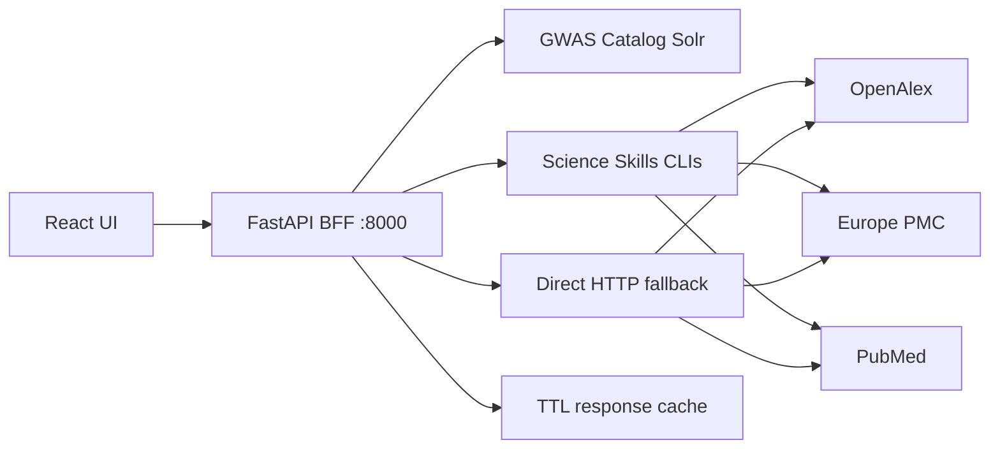

# GWAS PrePubMatch

**GWAS PrePubMatch** makes pre-publication GWAS summary statistics discoverable alongside published GWAS Catalog studies and their literature. Paste messy submission metadata — title, authors, trait string — and get ranked **Catalog studies** (including pre-pub sumstats) and **publications** in one unified view.

> *Problem:* ~8,000 pre-publication sumstats entries in the GWAS Catalog are poorly indexed for search. GWAS PrePubMatch bridges that discoverability gap with a production-oriented API and UI.

---

## Architecture



The FastAPI server is an **orchestrator**, not a simple proxy. It searches GWAS Catalog Solr and literature sources in parallel (Science Skills primary, direct HTTP fallback per source), scores and deduplicates results, and returns a unified JSON response (`schema_version: 3.1.0`).

---

## Quick Start (development)

### 1. Install Google Science Skills (recommended)

```bash
bash scripts/setup_science_skills.sh
```

Literature discovery uses **Google Science Skills as the primary path** (`literature-search-openalex`, `literature-search-europepmc`, `pubmed-database`). When a skill call fails or skills are not installed, the server falls back to direct HTTP for that source only.

### 2. Configure environment (optional)

```bash
cp .env.example .env
# Optional: OPENALEX_API_KEY, NCBI_API_KEY for higher rate limits
```

### 3. Start the API server

```bash
bash scripts/run_server.sh
# or: cd server && uv sync && uv run uvicorn traitgraph_server.main:app --port 8000
```

Verify: `curl -s http://127.0.0.1:8000/api/health | python3 -m json.tool`

### 4. Start the web dashboard

```bash
cd web
npm install
npm run dev
```

Open **[http://localhost:5173/](http://localhost:5173/)** — Vite proxies `/api` to port 8000.

### 5. Try a preset

On load, **Probable Match** runs discovery automatically. Switch presets (e.g. **High Confidence** — Pividori asthma) to re-run; click **Discover Related Studies** only after editing form fields.

---

## Production deployment (Docker)

```bash
cp .env.example .env
docker compose up --build
```

| Service | URL |
|---------|-----|
| API | http://localhost:8000/api/health |
| UI + nginx proxy | http://localhost:8080 |

The nginx config serves the React build and proxies `/api/` to the API container.

---

## API

### `GET /api/health`

Returns overall status (`ok` / `degraded` / `error`), `schema_version`, per-source latency probes, and cache settings.

### `POST /api/discover`

Request body (minimal):

```json
{
  "title": "Shared and distinct genetic risk factors for childhood-onset asthma",
  "authors": ["Pividori M", "Schoettler N"],
  "reported_trait": "childhood asthma"
}
```

Key response fields:
- `related_results[]` — unified ranked Catalog studies + publications + literature
- `discovery_summary` — counts, top match, `degraded_sources` if any upstream failed
- `source_status` — per-source ok/degraded
- `gwas_catalog_provenance` / `literature_provenance` — transparent call metadata

Example:

```bash
curl -s -X POST http://127.0.0.1:8000/api/discover \
  -H 'Content-Type: application/json' \
  -d @examples/traitgraph_messy_asthma_prepub.json | python3 -m json.tool
```

---

## Configuration

| Variable | Default | Description |
|----------|---------|-------------|
| `PREPUBMATCH_HOST` | `127.0.0.1` | Bind address (`0.0.0.0` in Docker) |
| `PREPUBMATCH_PORT` | `8000` | API port |
| `PREPUBMATCH_CORS_ORIGINS` | localhost dev URLs | Comma-separated CORS origins |
| `PREPUBMATCH_CACHE` | `true` | Enable in-memory TTL cache |
| `PREPUBMATCH_CACHE_TTL_CATALOG` | `3600` | Catalog Solr cache seconds |
| `PREPUBMATCH_CACHE_TTL_LITERATURE` | `7200` | Literature cache seconds |
| `OPENALEX_API_KEY` | — | Optional OpenAlex rate limit key |
| `NCBI_API_KEY` | — | Optional PubMed rate limit key |

See `.env.example` for the full list.

---

## Google Science Skills

Science Skills are **required for the full hackathon-faithful experience** and are the primary literature search path:

```bash
bash scripts/setup_science_skills.sh
```

The Docker image runs this script at build time. Without skills, discovery still works via direct HTTP fallback.

---

## Legacy CLI Reconciler

```bash
python3 .agent/skills/traitgraph-gwas-reconciler/scripts/reconcile_gwas.py
```

See [AGENTS.md](AGENTS.md) for pipeline details.
